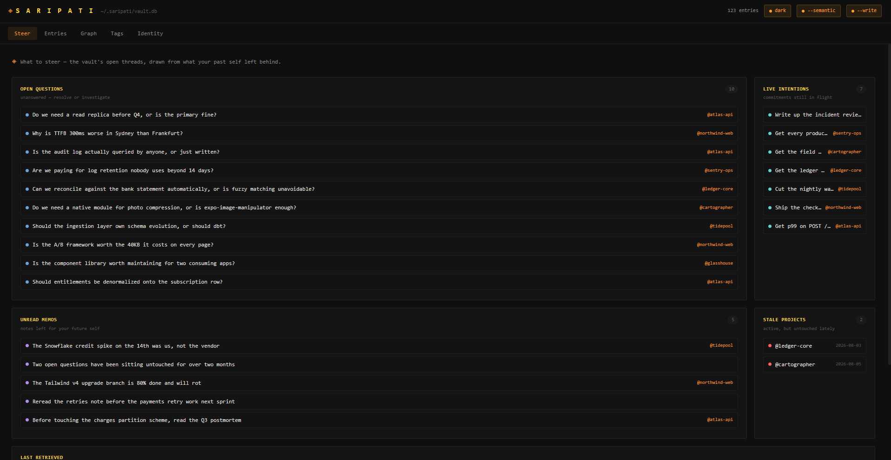

# SARIPATI

[](https://www.npmjs.com/package/saripati)
[](https://nodejs.org)
[](https://github.com/kyouscireul/saripati/actions/workflows/ci.yml)
[](./LICENSE)

**A local-first, provider-agnostic knowledge vault for any AI host.**

> *sari pati* (Malay) — the essence, the concentrated extract.

Most AI tools start every conversation cold. SARIPATI is the memory layer that sits
*underneath* whatever AI you already use — Claude Code, Cursor, Windsurf, Cline, Continue —
and lets knowledge **compound** across sessions. The AI researches with its own tools; you
call SARIPATI to distill and store the essence. Weeks later, it recalls it semantically.

It is **not** a chat app. It runs no LLM and needs no API keys. Your entire knowledge base
is a single SQLite file on your own machine.

---

## Why

- **Compounding, not disposable.** Research done in a session persists and accumulates by
  topic — the corpus grows every time the agent runs, not only when you take notes.
- **Semantic recall, local.** Bundled embeddings (all-MiniLM-L6-v2) power hybrid
  semantic + keyword search entirely on-device.
- **A steerer, not just a store.** The agent gets *signal*, not just recall: proactive
  **nudges** at session start (open questions, live intentions, unread memos, stale
  projects), per-kind priority, and **conflict detection** — every save is checked against
  the corpus so contradictions surface instead of piling up as equal "truth."
- **Knows who it serves.** An optional identity + AI-companion persona loads at session
  start, so any host can adopt the right voice and address you correctly.
- **Visible.** A launch-on-demand dashboard makes the growing knowledge base browsable,
  searchable, and (opt-in) editable.
- **Zero lock-in.** Local SQLite, MIT-licensed, no cloud account, no vendor.

## Non-goals

- Not a chat app or LLM wrapper — it does not run or require an LLM.
- No cloud dependency required.
- Not tied to any single AI host or provider.

---

## Install

**Requires Node 22 or newer** (Node 22 LTS recommended; 24 supported). Every native
dependency ships prebuilt binaries, so no compiler, Visual Studio, or Xcode is needed.
Windows on ARM is not currently supported — `sqlite-vec` publishes no `win32-arm64`
build. SARIPATI tells you plainly if your machine is unsupported instead of failing
with a build log.

**Guided path — let your AI do it.** Open [`ONBOARD.md`](./ONBOARD.md), **copy its
contents, and paste them into your AI host** (Claude Code, Cursor, Windsurf, etc.),
then say "set up saripati." It checks your environment, asks five identity questions,
generates and runs the setup, and adds the system prompt — all in one conversation,
before MCP is running.

> Paste the contents; do not just link the file. Most agents treat *fetched* files as
> data to read, not instructions to execute, so pointing an agent at this URL will
> usually get you a summary instead of an install.

**Manual path — do it yourself.** Equally supported:

```bash
npx saripati setup                          # create vault, print config + detected hosts
npx saripati setup ./setup.md --write       # load identity from file + register with hosts
npx saripati version                        # what version is actually running here
```

Upgrading on a machine that already has it? npx caches by package spec, so pin explicitly —
`npx saripati@latest ui` — and restart your MCP host. See [Troubleshooting](docs/guide.md#troubleshooting).

Either way, your host connects by **package name** — no folder path:

```json
{
  "mcpServers": {
    "saripati": { "command": "npx", "args": ["-y", "saripati", "mcp"] }
  }
}
```

Restart your AI host. The first `vault` call downloads the ~90 MB embedding model once
(with a progress heartbeat), then works offline forever.

To remove SARIPATI later, open [`UNINSTALL.md`](./UNINSTALL.md) in your AI host.

---

## The tools (9)

| Tool | What it does — and when to call it |
|------|------------------------------------|
| `on` | **Start of every session, unprompted.** Loads identity, last session, recent entries, active projects, and `nudges`. |
| `off` | **Session end.** Write the digest + next steps yourself. |
| `vault` | **The one door to knowledge.** Pass `query` to recall; pass `content`/`findings` to save. Every save runs a conflict check. |
| `entry_update` | Resolve a flagged conflict: supersede, relink, lower confidence, resolve a question, close an intention. |
| `corpus` | A map of what already exists — counts, top tags, per-project last activity. |
| `project_update` / `project_list` | A lightweight project registry (metadata merges). |
| `whoami` | Return the vault owner's identity + companion persona. |
| `identity_set` | Create/update identity + tuning (`companion_config`) — fields merge. |

A typical flow: `on` at session start → the AI researches with its own tools → `vault` save
→ (conflict? `entry_update`) → next week `vault` recall → `off` at the end.

### What that actually looks like

**Monday — the agent finishes researching and distils what it learned.**

```jsonc
vault({
  topic:    "Postgres connection pooling for serverless",
  findings: [
    "PgBouncer transaction mode breaks prepared statements; use session mode or disable them.",
    "Supabase's pooler runs on 6543; the direct 5432 port bypasses it and exhausts connections."
  ],
  tags:     ["postgres", "serverless", "pooling"],
  project:  "checkout-api",
  sources:  [{ url: "https://supabase.com/docs/guides/database/connecting-to-postgres" }]
})

// → "Saved research #142: \"Postgres connection pooling for serverless\"."
// { "saved": { "id": 142, "title": "Postgres connection pooling for serverless",
//              "kind": "research" } }
```

**Three weeks later, in a cold session with no shared history** — a paraphrase finds it:

```jsonc
vault({ query: "why do our prepared statements fail in production?" })

// → "Recalled 2 entries for \"why do our prepared statements fail in production?\"."
// [
//   { "id": 142, "kind": "research", "title": "Postgres connection pooling for serverless",
//     "excerpt": "- PgBouncer transaction mode breaks prepared statements; use session…",
//     "tags": ["postgres", "serverless", "pooling"], "project": "checkout-api",
//     "status": "active", "confidence": null, "score": 0.03252,
//     "matched": ["semantic", "keyword"] },
//   { "id": 98, "kind": "decision", "title": "Pin the pooler to session mode",
//     "excerpt": "We accept the connection ceiling in exchange for prepared…",
//     "status": "active", "score": 0.01639, "matched": ["semantic"] }
// ]
```

Nothing was re-researched, and no keyword in the question appears in the stored title.
`matched` shows which retriever fired — `score` is the fused rank.

---

## The Steerer model

Entries carry a **kind** and a **lifecycle**, so recall returns signal, not noise.

- **Kinds:** `research` · `note` · `decision` · `pattern` · `question` · `memo` · `intention`.
  Questions track `resolved`; intentions track `active`; memos are the agent's notes to its
  future self and surface first at `on`.
- **Status:** `active` · `superseded` · `archived`. Superseded/archived entries drop out of
  default recall (pass `include_superseded` to see them) — old decisions stop being cited as
  current truth.
- **Priority:** a per-kind boost (memo > question > decision/intention > pattern > research/
  note), tunable per vault via `identity_set({ companion_config: { recall_boost: … } })`.
- **Conflict detection:** after every save, `vault` runs a narrow similarity check and
  returns near-duplicate or contradicting entries so the agent can `entry_update` them.

---

## Identity — who the vault serves

The ONBOARD.md flow collects your identity conversationally and generates a filled
`setup.md`. You can also fill it manually:

```yaml
---
name:      Your Name
field:     Software Engineering
skills:    [supabase, next.js, laravel]
language:  English
companion: librarian     # plain | librarian | research-assistant
---
```

Stored in a singleton `identity` row. From then on `on` and `whoami` hand your host
that context at session start, so it adopts the right voice and addresses you correctly.
Update any time with `identity_set` (fields merge). Set a focus with
`identity_set({ user_prefs: { focus: "project-name" } })` and `on` biases recent entries
toward it.

---

## The dashboard

```bash
npx saripati ui                  # http://localhost:4319 — read-only by default
npx saripati ui --write          # enable in-browser tag/kind edits
npx saripati ui --no-semantic    # FTS only — faster cold start, no model load
npx saripati ui --port 8080      # custom port
```

<!-- Capture pending: docs/media/steer.png (Steer tab) and docs/media/graph.png
     (Graph tab) are referenced here but not yet committed. Drop real captures at
     those paths and delete this comment. -->


A local browser UI built on **Preact 10 + HTM** (no CDN, no bundler — vendored ESM served at
`/vendor/*.js`). Five tabs — **Steer** opens by default:

| Tab | What it shows |
|-----|---------------|
| **Steer** | Live nudge console: open questions · active intentions · unread memos · stale projects. Retrieval trace (last `vault` recall — query, timestamp, scored results). Click any row to jump to the entry. |
| **Entries** | Hybrid search · 7 kind chips · status chips (active / superseded / archived) · `@project` / tag filters · entry detail with sources, backlinks, typed links, lifecycle fields (`superseded_by`, `resolved`, `active`). Infinite scroll in browse mode (50 entries per page); search and filtered views fetch the full matching set. |
| **Graph** | Physics force-graph over derived links. Up to 150 nodes; four edge types — **relation** (author-asserted typed links), **wikilink**, **project**, **tag** — strongest wins per pair, each toggleable (hidden types leave the simulation, not just the render). Node size scales with connection count. Search (`/` to focus) rings matches and dims the rest. Ubiquitous tags are excluded from edges — vault-wide (>25 % of nodes) and, for entries in the same project, within that project too, so a tag saturating one small project can't turn it into a mesh. Scroll to zoom, drag canvas to pan, drag a node to pin it where you drop it, shift-click to pin/unpin; pins persist across reloads. The layout stops when it actually settles and auto-fits once — use **reset** to re-run it. |
| **Tags** | Tag cloud and frequency. |
| **Identity** | Profile · companion config (stale\_days, conflict\_threshold, per-kind recall boosts) · session history. |

Editing is **off by default** — pass `--write` to enable mutations (kind, tags, status, resolved, active).

---

## How it works

```
AI host (its own web tools)  ──stdio/MCP──▶  saripati mcp
                                                 │
                    embed (MiniLM 384d) ─────────┤
                    hybrid search (vec ∪ FTS5) ──┤
                    per-kind boost + status ─────┤
                                                 ▼
                                    ~/.saripati/vault.db  (SQLite)
                                    ▲
                    saripati ui ────┘  (read-only dashboard)
```

- **Storage:** SQLite via `better-sqlite3`, versioned with a `PRAGMA user_version` migration
  runner — existing vaults upgrade in place on open.
- **Vectors:** `sqlite-vec` (vec0) — embeddings are L2-normalized so KNN ranks like cosine.
- **Keyword:** SQLite FTS5. **Fusion:** Reciprocal Rank Fusion combines the two rankings.
- **Embeddings:** `@xenova/transformers` running all-MiniLM-L6-v2 in-process.
- **Terminal voice:** a small zero-dep presentation layer (`src/term/theme.ts`) that degrades
  to plain ASCII off-TTY and never touches the JSON-RPC channel (banners go to stderr).

Data lives in `~/.saripati/` by default (override with `SARIPATI_HOME` or `SARIPATI_DB`).

---

## Develop

```bash
npm install
npm run build      # tsc → dist/ (+ vendored UI bundles)
npm test           # end-to-end smoke test (from source)
npm run test:install # cold install: pack, install the tarball, drive it as a user would
npm run dev -- mcp # run from source via tsx
```

## Contributing

Issues and pull requests are welcome — bug reports, platform coverage, and
documentation fixes especially. Open an
[issue](https://github.com/kyouscireul/saripati/issues) or start a
[discussion](https://github.com/kyouscireul/saripati/discussions).

Before opening a PR, run the full gate:

```bash
npm run build
npm test              # smoke suite, from source
npm run test:install  # cold install — packs, installs, and drives the tarball
```

If you hit an install failure, include the output of `npx saripati@latest version`
and your `node -v` — that pair identifies almost every case.

## License

MIT © Kyou
