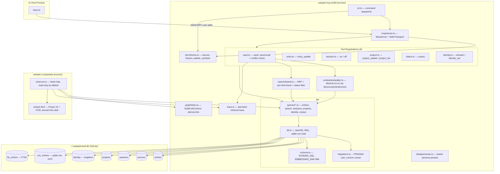
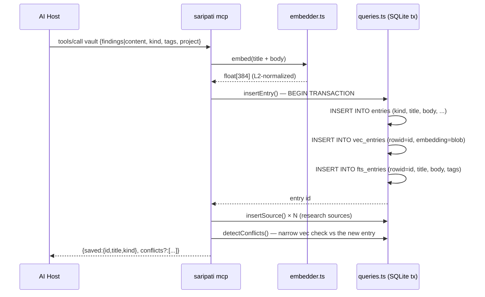

# SARIPATI — Architecture

## Overview

SARIPATI is a **local-first MCP (Model Context Protocol) server** that gives any AI host a
persistent, compounding knowledge vault. It runs as a child process spawned by the host,
communicates over stdio using JSON-RPC 2.0, and stores all state in a single SQLite file on
the user's machine. It runs no LLM and requires no API keys.

---

## System Context


---

## Component Architecture



`term/theme.ts` is the zero-dependency presentation layer used by the CLI (`setup`, bare
invocation) and by `mcp/server.ts` (startup banner to **stderr only**). `graph/links.ts`
holds the canonical link-derivation rule that powers the dashboard's `/api/graph` and
`/api/backlinks` endpoints. `trace.ts` is the cross-process retrieval trace: `vault` recall
writes the last fetch to a small JSON in the data dir, which the UI reads at `/api/last-fetch`.

---

## Module Responsibilities

| Module | File | Responsibility |
|--------|------|----------------|
| CLI dispatcher | `src/cli.ts` | Parses `process.argv`, lazy-imports the right subcommand (`setup`/`mcp`/`ui`); bare invocation + `help` print the banner |
| Path resolution | `src/config.ts` | Resolves `dataDir`, `dbPath`, `modelCacheDir`; `ensureDataDir` |
| Presentation | `src/term/theme.ts` | Zero-dep terminal voice: `caps()`, palette, `◈` symbols, `banner`, `frame`, `steps`, `report`; single `VERSION` from package.json |
| Database open | `src/db/db.ts` | Opens SQLite, sets WAL + FK pragmas, loads sqlite-vec, applies `SCHEMA_SQL`, then runs migrations |
| Migrations | `src/db/migrations.ts` | `PRAGMA user_version` runner; migration 2 rebuilds `entries` to widen `kind` + add lifecycle columns |
| Schema | `src/db/schema.ts` | Embedded baseline `SCHEMA_SQL` string; defines `EMBEDDING_DIM = 384` |
| Queries | `src/db/queries/*.ts` | Domain modules (entries, search, sessions, projects, identity, corpus) re-exported by `queries.ts`; atomic tri-table tx; nudge helpers (`unresolvedQuestions`, `activeIntentions`, `unreadMemos`, `lastEntryAtByProject`) |
| Link graph | `src/graph/links.ts` | `buildLinkContext`, `deriveLinks` (canonical edge rule: `relation > wikilink > project > tag`) — powers the UI graph |
| Retrieval trace | `src/trace.ts` | `writeLastFetch` / `readLastFetch` — cross-process record of the last recall |
| Embedder | `src/embed/embedder.ts` | Singleton pipeline: `Xenova/all-MiniLM-L6-v2`, mean-pool + L2-normalize → 384-dim float[] |
| Hybrid search | `src/search/hybrid.ts` | RRF fusion of vec KNN + FTS5 BM25 (`RRF_K = 60`), per-kind boost, superseded/archived exclusion |
| Personas | `src/data/personas.ts` | Starter persona presets (librarian / research-assistant / plain) — pure data |
| Setup | `src/commands/setup.ts` | `saripati setup [setup.md]` — create the vault, parse identity frontmatter, print the MCP snippet; `--write` merges config into detected hosts; `--host`, `--from`, `--dev` |
| MCP server | `src/mcp/server.ts` | Banner to stderr, warms model (with heartbeat) before transport connects, registers all 9 tools, stdio transport, SIGINT/SIGTERM shutdown |
| Tool: vault | `src/mcp/tools/vault.ts` | `vault` — routes save vs recall; save runs a post-save conflict check; recall applies boosts + writes the trace |
| Tool: entry | `src/mcp/tools/entry.ts` | `entry_update` — metadata-only mutation (status, superseded_by, links, resolved, active, tags, kind) |
| Tool: session | `src/mcp/tools/session.ts` | `on` (identity + last session + recent + projects + nudges + focus bias), `off` |
| Tool: project | `src/mcp/tools/project.ts` | `project_update` (JSON-patch merge), `project_list` |
| Tool: status | `src/mcp/tools/status.ts` | `corpus` — counts, byKind, topTags, per-project `last_entry_at` |
| Tool: identity | `src/mcp/tools/identity.ts` | `whoami` (getIdentity), `identity_set` (upsertIdentity, fields merge) |
| Result helpers | `src/mcp/tools/_result.ts` | `jsonResult` (summary + JSON), `bannerResult` (wordmark + summary + JSON, used by `on`/`off`/`corpus`), `textResult`, `deriveTitle`, `excerpt` |
| UI server | `src/ui/server.ts` | Node `http.createServer`; serves vendored ESM from `dist/vendor/` (dev falls back to node_modules); JSON API incl. `/api/last-fetch`; **read-only by default** — `--write` enables PATCH `/api/entry/:id` |
| UI HTML | `src/ui/web.html` | Real HTML file — **Preact 10 + HTM** loaded via ESM at `/vendor/*.js`; `<script type="importmap">` resolves bare `"preact"` specifier for `hooks.module.js`; 2 themes (light default / dark, CSS vars, `localStorage`); 4 tabs (Entries · Graph · Tags · Identity); canvas force-graph — thermal-noise seeding phase, then runs until the layout converges (average node speed below threshold for 30 consecutive frames, hard ceiling 1200 frames) and auto-fits once; degree-scaled node radii, per-edge-type toggles that also gate the physics, node search, `localStorage`-persisted pins; regex markdown renderer; SessionsPanel (last 5 sessions) beside entry detail; mini corpus stat footer in sidebar; `@project` click-to-filter. Built by `scripts/copy-ui.mjs`. |

---

## Data Flow: Write Path (`vault` save)



**Key invariant:** `insertEntry` is a single `db.transaction()` — `entries`, `vec_entries`,
and `fts_entries` rows are always inserted atomically. If any step fails, all three roll back.

---

## Data Flow: Read Path (`vault` recall)

```mermaid
sequenceDiagram
    participant Host as AI Host
    participant MCP as saripati mcp
    participant Emb as embedder.ts
    participant Srch as hybrid.ts
    participant DB as queries.ts

    Host->>MCP: tools/call vault {query, limit?, kind?, include_superseded?}
    MCP->>Emb: embed(query)
    Emb-->>MCP: float[384]
    MCP->>Srch: hybridSearch(db, embedding, queryText, {limit, kind, boosts, includeSuperseded})
    Srch->>DB: vecSearch(embedding, candidateCount) → VecHit[]
    Srch->>DB: ftsSearch(queryText, candidateCount) → FtsHit[]
    Srch->>Srch: RRF fusion × per-kind boost; drop superseded/archived
    Srch->>DB: getEntriesByIds(merged id set)
    Srch-->>MCP: HybridResult[] sorted by score desc
    MCP->>MCP: writeLastFetch() — retrieval trace for the UI
    MCP-->>Host: {content: [{type:"text", text:"Recalled N entries..."}]}
```

`candidateCount = max(limit × 4, 20)` — both vec and FTS legs fetch 4× the requested limit
before fusion, then the fused set is sorted and sliced.

---

## Hybrid Search: Reciprocal Rank Fusion

RRF avoids normalizing incompatible score scales (L2 distance vs BM25) by combining
**rankings** rather than raw scores.

```
score(id) = Σ  1 / (RRF_K + rank_i + 1)
            i ∈ {vec, fts} if id appears in that list
```

- `RRF_K = 60` (standard RRF constant, reduces sensitivity to rank-1 outliers)
- rank is 0-indexed within each list
- An entry appearing in **both** lists scores at least `2 / (60 + 1)` ≈ 0.033 — double any
  rank-0 single-list entry's contribution
- `matchedVec` and `matchedFts` booleans are returned per result so the host can see which
  leg(s) produced each hit

---

## Embedding Layer

- **Model:** `Xenova/all-MiniLM-L6-v2` via `@xenova/transformers` (ONNX runtime, in-process)
- **Dimensionality:** 384
- **Pooling:** mean-pool over token embeddings
- **Normalization:** L2-normalized → stored as normalized vectors
- **Storage consequence:** because vectors are L2-normalized, `vec_entries`'s default L2 KNN
  distance ranking is equivalent to cosine similarity ranking (L2 on normalized = cosine)
- **Cache:** downloaded once to `<dataDir>/models`, reused offline
- **Singleton:** `pipePromise` is module-level; only one pipeline is ever constructed per process
- **Warmup:** `mcp/server.ts` calls `warmup()` before the transport connects — model load
  output goes to stderr only, never corrupting the JSON-RPC stdout stream

---

## Presentation Layer

`src/term/theme.ts` gives SARIPATI its own terminal voice with **zero runtime dependencies**
— raw ANSI + Unicode box-drawing, hand-rolled.

- **Capabilities per stream.** `caps(stream)` decides colour and Unicode from that specific
  stream: colour requires a TTY and no `NO_COLOR` (or `FORCE_COLOR` to force); Unicode
  additionally requires a real TTY, `TERM != dumb`, and no `SARIPATI_ASCII=1`. When off,
  everything collapses to clean 7-bit ASCII with no escape codes.
- **Forcing the full UI.** `SARIPATI_UNICODE=1` (alias `SARIPATI_RICH=1`) forces both colour
  and Unicode on. This exists because TTY detection fails in environments that are perfectly
  capable of rendering the box — a host that pipes stdout (the Claude Code terminal), npx/npm
  shims on Windows, some IDE consoles. Before it there was no way to request the rounded frame
  at all: `unicode` keyed off `isTTY` alone, so those terminals were stuck with `+---+`
  forever, and `FORCE_COLOR` produced a mongrel (amber escapes wrapped around ASCII corners).
  It is opt-in, so pipes, CI logs, and the MCP stderr path keep the clean-ASCII default;
  `SARIPATI_ASCII=1` and `TERM=dumb` remain hard opt-outs that beat it.
- **Protocol safety.** The `◈ S A R I P A T I` wordmark and all diagnostics are rendered
  with `caps(process.stderr)` and written to **stderr only** on the `mcp` path — stdout stays
  pure JSON-RPC. This is the same discipline the embedder warmup already follows.
- **Single version source.** `VERSION` is read once from `package.json` via `import.meta.url`
  (falling back to `0.0.0`), and feeds both the banner and the MCP `serverInfo.version`.
- **Shared helpers.** `frame` (titled rounded box), `steps` (`[n/N]` progress), and `report`
  (semantic-toned count table) are consumed by `setup` and the MCP banner, so every surface
  reads as one product.

## Steerer Layer (kinds, status, boost, conflicts)

v0.3.0 turns the store into a *steerer* — recall returns signal, not just matches.

- **Link graph.** `src/graph/links.ts` (`deriveLinks`) is the single rule for edges — explicit
  typed relations from `entry_update`'s `links`, explicit `[[..]]` resolved by basename then
  title-slug, plus implicit shared-project and shared-tag edges (capped). The strongest type
  wins per target: `relation > wikilink > project > tag`. It powers the dashboard's
  `/api/graph` + `/api/backlinks`; both treat `relation` and `wikilink` as explicit references.
  Dangling link ids (the target was deleted — `entry_update` does no referential check) are
  dropped during derivation.
- **Per-kind boost + status filter.** `hybridSearch` multiplies each fused score by a per-kind
  factor (memo > question > decision/intention > pattern > research/note, tunable via
  `companion_config.recall_boost`) and drops `superseded`/`archived` entries unless
  `include_superseded` is set.
- **Conflict detection.** After every `vault` save, a narrow vec similarity check (cosine ≥
  `companion_config.conflict_threshold`, default 0.85) returns near-duplicate/contradicting
  entries, which the agent resolves with `entry_update` (supersede / link / lower confidence).
- **Nudges.** `on` surfaces unresolved questions, active intentions, unread memos (created
  since the last session), and stale projects (no entries in > `stale_days`, default 21).

## SQLite Configuration

```sql
PRAGMA journal_mode = WAL;    -- concurrent readers while writer is active
PRAGMA foreign_keys = ON;     -- sources.entry_id → entries.id ON DELETE CASCADE
```

`sqlite-vec` is loaded as a dynamic extension via `sqliteVec.load(db)` on every connection
open, wiring the `vec0` virtual table module into that connection.

---

## Stdio Protocol

The host spawns `saripati mcp` (or `npx -y saripati mcp`) as a child process. Communication
is **JSON-RPC 2.0** messages, one per line, over the process's stdin/stdout pair.

```
Host            saripati mcp process
 │                      │
 │── initialize ───────▶│  (protocolVersion, capabilities, clientInfo)
 │◀── result ───────────│  (serverInfo: {name:"saripati", version: <package.json>})
 │                      │
 │── tools/list ────────▶│
 │◀── result ───────────│  (9 tool descriptors with inputSchema)
 │                      │
 │── tools/call ────────▶│  (name, arguments)
 │◀── result ───────────│  (content: [{type:"text", text:"..."}])
```

**stdout = JSON-RPC only.** All diagnostic output — the startup banner, model loading, and
the vault path — goes to stderr, rendered with `caps(process.stderr)`.

---

## Distribution Tiers

| Tier | Install | Notes |
|------|---------|-------|
| 1 — npm | `npx -y saripati mcp` | Primary path. `npx` fetches on first use, caches locally. |
| 2 — setup auto-config | `npx -y saripati setup --write` | Writes `mcpServers.saripati` into detected host configs, backs up existing file. |

> Single-file `bun --compile` binaries were removed in v0.3.0: the native addons
> (better-sqlite3, sqlite-vec, onnxruntime-node) cannot be bundled cleanly, so the feature
> was never real. npm is the supported distribution path.

Host detection in `setup` scans for: `~/.claude.json` (Claude Code), `~/.cursor/mcp.json`
(Cursor), `~/.codeium/windsurf/mcp_config.json` (Windsurf),
`%APPDATA%/Claude/claude_desktop_config.json` (Claude Desktop).

---

## CI / Release Pipeline

```mermaid
graph LR
    subgraph CI["CI (push to main / PR)"]
        C1[checkout] --> C2[setup-node@20]
        C2 --> C3[cache MiniLM model]
        C3 --> C4[npm ci]
        C4 --> C5[npm run build]
        C5 --> C6[npm test]
    end

    subgraph REL["Release (push tag v*)"]
        R1[npm-publish job] --> R2[npm publish --access public]
    end
```

Release triggers on any tag matching `v*`. The npm publish job uses `NODE_AUTH_TOKEN` from
repository secrets. (In practice, publishing is done manually with a fresh OTP, since the npm
account uses TOTP 2FA.)
