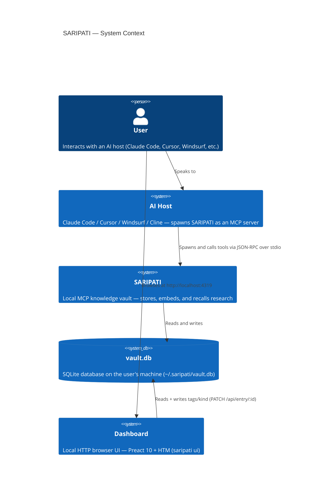
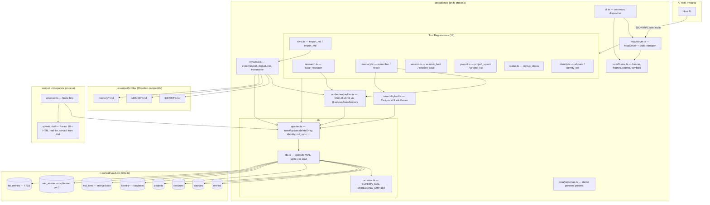
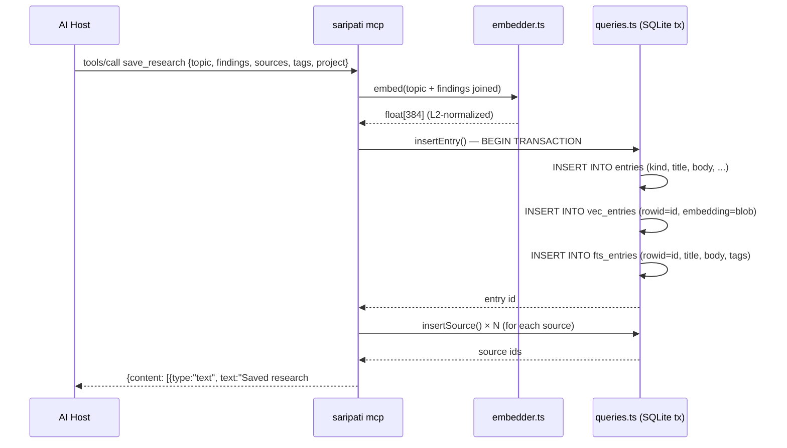
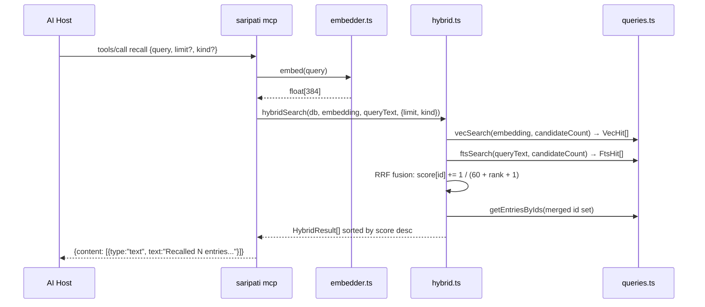

# SARIPATI — Architecture

## Overview

SARIPATI is a **local-first MCP (Model Context Protocol) server** that gives any AI host a
persistent, compounding knowledge vault. It runs as a child process spawned by the host,
communicates over stdio using JSON-RPC 2.0, and stores all state in a single SQLite file on
the user's machine. It runs no LLM and requires no API keys.

---

## System Context



---

## Component Architecture



`term/theme.ts` is the zero-dependency presentation layer used by the CLI (bare invocation,
`onboard`) and by `mcp/server.ts` (startup banner to **stderr only**). `sync/md.ts` is the
bidirectional Markdown engine driven by both the `export`/`import`/`sync` CLI commands and
the `export_md`/`import_md` MCP tools.

---

## Module Responsibilities

| Module | File | Responsibility |
|--------|------|----------------|
| CLI dispatcher | `src/cli.ts` | Parses `process.argv`, lazy-imports the right subcommand; bare invocation + `help` print the banner |
| Path resolution | `src/config.ts` | Resolves `dataDir`, `dbPath`, `modelCacheDir`, `profileDir`, `memoryDir`; `ensureProfileDir` (on-demand) |
| Presentation | `src/term/theme.ts` | Zero-dep terminal voice: `caps()`, palette, `◈` symbols, `banner`, `frame`, `steps`, `report`; single `VERSION` from package.json |
| Database open | `src/db/db.ts` | Opens SQLite, sets WAL + FK pragmas, loads sqlite-vec extension, applies schema |
| Schema | `src/db/schema.ts` | Embedded `SCHEMA_SQL` string (incl. `identity`, `md_sync`); defines `EMBEDDING_DIM = 384` |
| Queries | `src/db/queries.ts` | All SQL: insert/**update**/**delete**Entry (atomic tri-table tx), vec/ftsSearch, upsertProject, **identity**, **md_sync**, `allEntries` |
| Embedder | `src/embed/embedder.ts` | Singleton pipeline: `Xenova/all-MiniLM-L6-v2`, mean-pool + L2-normalize → 384-dim float[] |
| Hybrid search | `src/search/hybrid.ts` | RRF fusion of vec KNN + FTS5 BM25, `RRF_K = 60` |
| Markdown sync | `src/sync/md.ts` | Bidirectional engine: `exportVault`, `importVault` (3-way reconcile), `deriveLinks` (canonical rule), frontmatter parse/serialize, `contentHash` |
| Personas | `src/data/personas.ts` | Starter persona presets (librarian / research-assistant / plain) — pure data |
| Init | `src/commands/init.ts` | `saripati init` — create the vault, detect host config files, print the MCP snippet; `--write` merges config into detected hosts (backs up first); `--host` targets a single host; `--dev` emits a local node path instead of `npx saripati` |
| Onboarding | `src/commands/onboard.ts` | `saripati onboard` — 5-step readline flow (TTY or piped), `--print` / `--reset` |
| Sync commands | `src/commands/sync.ts` | `runExport` / `runImport` / `runSync` — `--md`, `--out`, `--force-md`, `--prune`; themed reports |
| MCP server | `src/mcp/server.ts` | Prints banner to stderr, warms model before transport connects, registers all 12 tools, stdio transport, SIGINT/SIGTERM shutdown |
| Tool: research | `src/mcp/tools/research.ts` | `save_research` — embeds, inserts entry + sources |
| Tool: memory | `src/mcp/tools/memory.ts` | `remember` (embed + insert), `recall` (embed + hybridSearch) |
| Tool: session | `src/mcp/tools/session.ts` | `session_boot` (identity + last session + recent entries + active projects), `session_save` |
| Tool: project | `src/mcp/tools/project.ts` | `project_upsert` (JSON-patch merge on conflict), `project_list` |
| Tool: status | `src/mcp/tools/status.ts` | `corpus_status` — aggregates counts, byKind, topTags (json_each), lastUpdated |
| Tool: identity | `src/mcp/tools/identity.ts` | `whoami` (getIdentity), `identity_set` (upsertIdentity, fields merge) |
| Tool: sync | `src/mcp/tools/sync.ts` | `export_md` (exportVault), `import_md` (importVault) — needs `paths` |
| Result helpers | `src/mcp/tools/_result.ts` | `jsonResult`, `textResult`, `deriveTitle`, `excerpt` |
| UI server | `src/ui/server.ts` | Node `http.createServer`; reads `web.html` from disk; serves `/vendor/preact.js`, `/vendor/hooks.js`, `/vendor/htm.js` (resolved via CJS path + `.module.js` suffix); 10 JSON API endpoints; `--write` and `--semantic` are **on by default** (`--no-write` / `--no-semantic` to disable); PATCH `/api/entry/:id` always live; `/api/entries?project=` for project filtering |
| UI HTML | `src/ui/web.html` | Real HTML file — **Preact 10 + HTM** loaded via ESM at `/vendor/*.js`; `<script type="importmap">` resolves bare `"preact"` specifier for `hooks.module.js`; 2 themes (light default / dark, CSS vars, `localStorage`); 4 tabs (Entries · Graph · Tags · Identity); continuous-physics canvas force-graph with thermal noise; regex markdown renderer; SessionsPanel (last 5 sessions) beside entry detail; mini corpus stat footer in sidebar; `@project` click-to-filter. Built by `scripts/copy-ui.mjs`. |

---

## Data Flow: Write Path (`save_research` / `remember`)



**Key invariant:** `insertEntry` is a single `db.transaction()` — `entries`, `vec_entries`,
and `fts_entries` rows are always inserted atomically. If any step fails, all three roll back.

---

## Data Flow: Read Path (`recall`)



`candidateCount = max(limit × 4, 20)` — both vec and FTS legs fetch 4× the requested limit
before fusion, then the fused set is sorted and sliced.

---

## Hybrid Search: Reciprocal Rank Fusion

RRF avoids normalizing incompatible score scales (L2 distance vs BM25) by combining
**rankings** rather than raw scores.

```
score(id) = Σ  1 / (RRF_K + rank_i + 1)
            i ∈ {vec, fts} if id appears in that list
```

- `RRF_K = 60` (standard RRF constant, reduces sensitivity to rank-1 outliers)
- rank is 0-indexed within each list
- An entry appearing in **both** lists scores at least `2 / (60 + 1)` ≈ 0.033 — double any
  rank-0 single-list entry's contribution
- `matchedVec` and `matchedFts` booleans are returned per result so the host can see which
  leg(s) produced each hit

---

## Embedding Layer

- **Model:** `Xenova/all-MiniLM-L6-v2` via `@xenova/transformers` (ONNX runtime, in-process)
- **Dimensionality:** 384
- **Pooling:** mean-pool over token embeddings
- **Normalization:** L2-normalized → stored as normalized vectors
- **Storage consequence:** because vectors are L2-normalized, `vec_entries`'s default L2 KNN
  distance ranking is equivalent to cosine similarity ranking (L2 on normalized = cosine)
- **Cache:** downloaded once to `<dataDir>/models`, reused offline
- **Singleton:** `pipePromise` is module-level; only one pipeline is ever constructed per process
- **Warmup:** `mcp/server.ts` calls `warmup()` before the transport connects — model load
  output goes to stderr only, never corrupting the JSON-RPC stdout stream

---

## Presentation Layer

`src/term/theme.ts` gives SARIPATI its own terminal voice with **zero runtime dependencies**
— raw ANSI + Unicode box-drawing, hand-rolled.

- **Capabilities per stream.** `caps(stream)` decides colour and Unicode from that specific
  stream: colour requires a TTY and no `NO_COLOR` (or `FORCE_COLOR` to force); Unicode
  additionally requires a real TTY, `TERM != dumb`, and no `SARIPATI_ASCII=1`. When off,
  everything collapses to clean 7-bit ASCII with no escape codes.
- **Protocol safety.** The `◈ S A R I P A T I` wordmark and all diagnostics are rendered
  with `caps(process.stderr)` and written to **stderr only** on the `mcp` path — stdout stays
  pure JSON-RPC. This is the same discipline the embedder warmup already follows.
- **Single version source.** `VERSION` is read once from `package.json` via `import.meta.url`
  (falling back to `0.0.0`), and feeds both the banner and the MCP `serverInfo.version`.
- **Shared helpers.** `frame` (titled rounded box), `steps` (`[n/N]` onboarding progress), and
  `report` (semantic-toned count table) are consumed by `onboard` and the sync commands, so
  every surface reads as one product.

## Markdown Sync (bidirectional)

`src/sync/md.ts` projects the vault to `~/.saripati/profile/` and reconciles hand edits back.
The `.db` remains the single source of truth; the folder is a synced projection.

- **Merge base.** `contentHash(entry)` is a 16-hex SHA-256 over normalized content (CRLF→LF,
  trimmed, tags sorted) — computed *identically* in both directions and stored in `md_sync`.
  So an unedited export→import is a **stable no-op**, never a spurious re-embed.
- **File shape.** `memory/{kind}_{slug}-{id}.md` = YAML frontmatter (incl. the join key `id`)
  + `# title` + body + a `GEN_MARKER`, below which sources/links/backlinks are auto-derived
  and **stripped on import** (generated content never re-enters the stored body).
- **Canonical links.** `deriveLinks` is the single rule for edges — explicit `[[..]]`
  resolved by basename then title-slug, plus implicit shared-project and shared-tag edges
  (capped, strongest type wins). The same rule will feed the Phase-3 graph, so MD and graph
  can never disagree. Backlinks invert *explicit* wikilinks only.
- **3-way reconcile.** `importVault` compares DB hash, file hash, and the stored base: only-MD
  changed → `updateEntry` (re-embedding via `sync/md.ts`, the caller); only-DB → skip; both →
  **conflict** (reported, DB untouched) unless `--force-md`. Hand-created files (no `id`) are
  inserted and back-filled to a canonical name; orphaned entries are reported, and deleted
  only under `--prune`.

## SQLite Configuration

```sql
PRAGMA journal_mode = WAL;    -- concurrent readers while writer is active
PRAGMA foreign_keys = ON;     -- sources.entry_id → entries.id ON DELETE CASCADE
```

`sqlite-vec` is loaded as a dynamic extension via `sqliteVec.load(db)` on every connection
open, wiring the `vec0` virtual table module into that connection.

---

## Stdio Protocol

The host spawns `saripati mcp` (or `npx -y saripati mcp`) as a child process. Communication
is **JSON-RPC 2.0** messages, one per line, over the process's stdin/stdout pair.

```
Host            saripati mcp process
 │                      │
 │── initialize ───────▶│  (protocolVersion, capabilities, clientInfo)
 │◀── result ───────────│  (serverInfo: {name:"saripati", version: <package.json>})
 │                      │
 │── tools/list ────────▶│
 │◀── result ───────────│  (12 tool descriptors with inputSchema)
 │                      │
 │── tools/call ────────▶│  (name, arguments)
 │◀── result ───────────│  (content: [{type:"text", text:"..."}])
```

**stdout = JSON-RPC only.** All diagnostic output — the startup banner, model loading, and
the vault path — goes to stderr, rendered with `caps(process.stderr)`.

---

## Distribution Tiers

| Tier | Install | Notes |
|------|---------|-------|
| 1 — npm | `npx -y saripati mcp` | Primary path. `npx` fetches on first use, caches locally. |
| 2 — init auto-config | `npx -y saripati init --write` | Writes `mcpServers.saripati` into detected host configs, backs up existing file. |
| 3 — binary | GitHub Release assets | `bun --compile` single-file binaries. Native addon bundling (better-sqlite3, onnxruntime-node) is **unverified**. Treat as best-effort. |

Host detection in `init` scans for: `~/.claude.json` (Claude Code), `~/.cursor/mcp.json`
(Cursor), `~/.codeium/windsurf/mcp_config.json` (Windsurf),
`%APPDATA%/Claude/claude_desktop_config.json` (Claude Desktop).

---

## CI / Release Pipeline

```mermaid
graph LR
    subgraph CI["CI (push to main / PR)"]
        C1[checkout] --> C2[setup-node@20]
        C2 --> C3[cache MiniLM model]
        C3 --> C4[npm ci]
        C4 --> C5[npm run build]
        C5 --> C6[npm test]
    end

    subgraph REL["Release (push tag v*)"]
        R1[npm-publish job] --> R2[npm publish --access public]
        R3[binaries matrix] --> R4[bun build --compile × 3 OS]
        R4 --> R5[GitHub Release assets]
    end
```

Release triggers on any tag matching `v*`. The npm publish job uses `NODE_AUTH_TOKEN` from
repository secrets. The binaries job has `fail-fast: false` — a binary build failure does
not block the npm publish.
