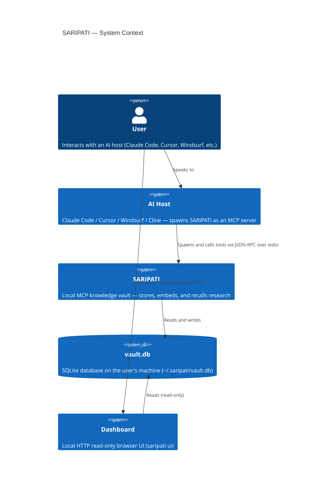
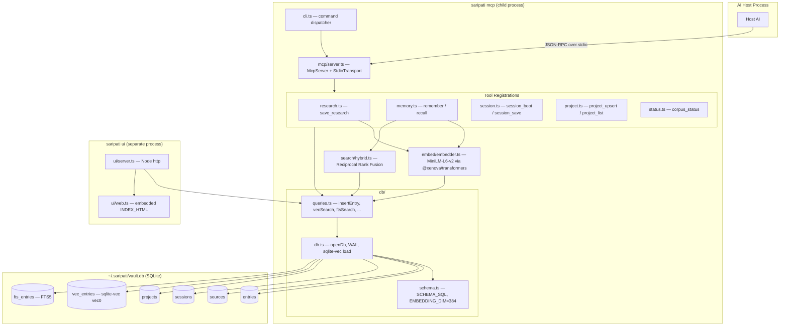
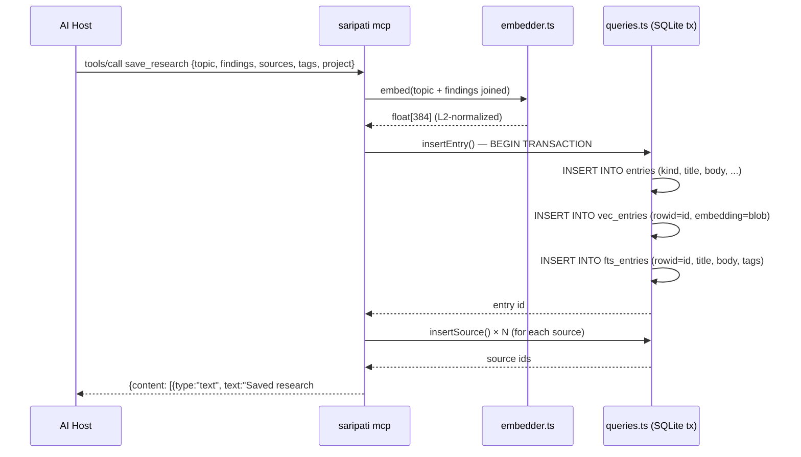
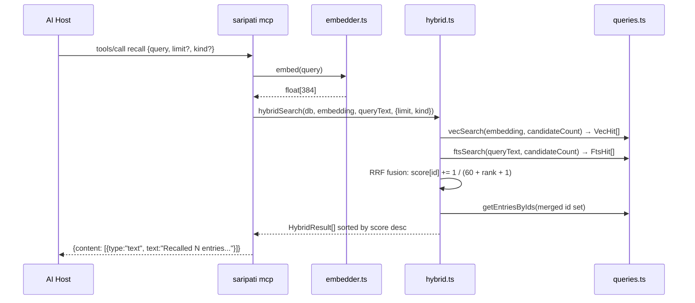

# SARIPATI — Architecture

## Overview

SARIPATI is a **local-first MCP (Model Context Protocol) server** that gives any AI host a
persistent, compounding knowledge vault. It runs as a child process spawned by the host,
communicates over stdio using JSON-RPC 2.0, and stores all state in a single SQLite file on
the user's machine. It runs no LLM and requires no API keys.

---

## System Context



---

## Component Architecture



---

## Module Responsibilities

| Module | File | Responsibility |
|--------|------|----------------|
| CLI dispatcher | `src/cli.ts` | Parses `process.argv`, lazy-imports the right subcommand |
| Path resolution | `src/config.ts` | Resolves `dataDir`, `dbPath`, `modelCacheDir` from env/flags |
| Database open | `src/db/db.ts` | Opens SQLite, sets WAL + FK pragmas, loads sqlite-vec extension, applies schema |
| Schema | `src/db/schema.ts` | Embedded `SCHEMA_SQL` string; defines `EMBEDDING_DIM = 384` |
| Queries | `src/db/queries.ts` | All SQL: insertEntry (atomic 3-table tx), vecSearch, ftsSearch, upsertProject, etc. |
| Embedder | `src/embed/embedder.ts` | Singleton pipeline: `Xenova/all-MiniLM-L6-v2`, mean-pool + L2-normalize → 384-dim float[] |
| Hybrid search | `src/search/hybrid.ts` | RRF fusion of vec KNN + FTS5 BM25, `RRF_K = 60` |
| MCP server | `src/mcp/server.ts` | Warms model before transport connects, registers all tools, stdio transport, SIGINT/SIGTERM shutdown |
| Tool: research | `src/mcp/tools/research.ts` | `save_research` — embeds, inserts entry + sources |
| Tool: memory | `src/mcp/tools/memory.ts` | `remember` (embed + insert), `recall` (embed + hybridSearch) |
| Tool: session | `src/mcp/tools/session.ts` | `session_boot` (last session + recent entries + active projects), `session_save` |
| Tool: project | `src/mcp/tools/project.ts` | `project_upsert` (JSON-patch merge on conflict), `project_list` |
| Tool: status | `src/mcp/tools/status.ts` | `corpus_status` — aggregates counts, byKind, topTags (json_each), lastUpdated |
| Result helpers | `src/mcp/tools/_result.ts` | `jsonResult`, `textResult`, `deriveTitle`, `excerpt` |
| UI server | `src/ui/server.ts` | Node `http.createServer`, serves `INDEX_HTML` + JSON API endpoints, opens browser |
| UI HTML | `src/ui/web.ts` | Exports `INDEX_HTML` — zero-build, self-contained vanilla JS/CSS |

---

## Data Flow: Write Path (`save_research` / `remember`)



**Key invariant:** `insertEntry` is a single `db.transaction()` — `entries`, `vec_entries`,
and `fts_entries` rows are always inserted atomically. If any step fails, all three roll back.

---

## Data Flow: Read Path (`recall`)



`candidateCount = max(limit × 4, 20)` — both vec and FTS legs fetch 4× the requested limit
before fusion, then the fused set is sorted and sliced.

---

## Hybrid Search: Reciprocal Rank Fusion

RRF avoids normalizing incompatible score scales (L2 distance vs BM25) by combining
**rankings** rather than raw scores.

```
score(id) = Σ  1 / (RRF_K + rank_i + 1)
            i ∈ {vec, fts} if id appears in that list
```

- `RRF_K = 60` (standard RRF constant, reduces sensitivity to rank-1 outliers)
- rank is 0-indexed within each list
- An entry appearing in **both** lists scores at least `2 / (60 + 1)` ≈ 0.033 — double any
  rank-0 single-list entry's contribution
- `matchedVec` and `matchedFts` booleans are returned per result so the host can see which
  leg(s) produced each hit

---

## Embedding Layer

- **Model:** `Xenova/all-MiniLM-L6-v2` via `@xenova/transformers` (ONNX runtime, in-process)
- **Dimensionality:** 384
- **Pooling:** mean-pool over token embeddings
- **Normalization:** L2-normalized → stored as normalized vectors
- **Storage consequence:** because vectors are L2-normalized, `vec_entries`'s default L2 KNN
  distance ranking is equivalent to cosine similarity ranking (L2 on normalized = cosine)
- **Cache:** downloaded once to `<dataDir>/models`, reused offline
- **Singleton:** `pipePromise` is module-level; only one pipeline is ever constructed per process
- **Warmup:** `mcp/server.ts` calls `warmup()` before the transport connects — model load
  output goes to stderr only, never corrupting the JSON-RPC stdout stream

---

## SQLite Configuration

```sql
PRAGMA journal_mode = WAL;    -- concurrent readers while writer is active
PRAGMA foreign_keys = ON;     -- sources.entry_id → entries.id ON DELETE CASCADE
```

`sqlite-vec` is loaded as a dynamic extension via `sqliteVec.load(db)` on every connection
open, wiring the `vec0` virtual table module into that connection.

---

## Stdio Protocol

The host spawns `saripati mcp` (or `npx -y saripati mcp`) as a child process. Communication
is **JSON-RPC 2.0** messages, one per line, over the process's stdin/stdout pair.

```
Host            saripati mcp process
 │                      │
 │── initialize ───────▶│  (protocolVersion, capabilities, clientInfo)
 │◀── result ───────────│  (serverInfo: {name:"saripati", version:"0.1.0"})
 │                      │
 │── tools/list ────────▶│
 │◀── result ───────────│  (8 tool descriptors with inputSchema)
 │                      │
 │── tools/call ────────▶│  (name, arguments)
 │◀── result ───────────│  (content: [{type:"text", text:"..."}])
```

**stdout = JSON-RPC only.** All diagnostic output (model loading, vault path) goes to stderr.

---

## Distribution Tiers

| Tier | Install | Notes |
|------|---------|-------|
| 1 — npm | `npx -y saripati mcp` | Primary path. `npx` fetches on first use, caches locally. |
| 2 — init auto-config | `npx -y saripati init --write` | Writes `mcpServers.saripati` into detected host configs, backs up existing file. |
| 3 — binary | GitHub Release assets | `bun --compile` single-file binaries. Native addon bundling (better-sqlite3, onnxruntime-node) is **unverified**. Treat as best-effort. |

Host detection in `init` scans for: `~/.claude.json` (Claude Code), `~/.cursor/mcp.json`
(Cursor), `~/.codeium/windsurf/mcp_config.json` (Windsurf),
`%APPDATA%/Claude/claude_desktop_config.json` (Claude Desktop).

---

## CI / Release Pipeline

```mermaid
graph LR
    subgraph CI["CI (push to main / PR)"]
        C1[checkout] --> C2[setup-node@20]
        C2 --> C3[cache MiniLM model]
        C3 --> C4[npm ci]
        C4 --> C5[npm run build]
        C5 --> C6[npm test]
    end

    subgraph REL["Release (push tag v*)"]
        R1[npm-publish job] --> R2[npm publish --access public]
        R3[binaries matrix] --> R4[bun build --compile × 3 OS]
        R4 --> R5[GitHub Release assets]
    end
```

Release triggers on any tag matching `v*`. The npm publish job uses `NODE_AUTH_TOKEN` from
repository secrets. The binaries job has `fail-fast: false` — a binary build failure does
not block the npm publish.
