# SARIPATI — Entity Relationship Diagram

All state lives in a single SQLite file (`~/.saripati/vault.db` by default).
There are six regular tables, two virtual tables (one per index), and one
embedded string constant that defines the entire schema.

> **v0.2.0** added two tables — `identity` (a singleton profile + companion
> persona) and `md_sync` (the merge base for bidirectional Markdown sync).

---

## ERD

```mermaid
erDiagram
    entries {
        INTEGER id PK "AUTOINCREMENT"
        TEXT    kind   "CHECK: research|note|decision|pattern"
        TEXT    title  "NOT NULL"
        TEXT    body   "NOT NULL"
        REAL    confidence "nullable — 0.0 to 1.0"
        TEXT    tags   "JSON array TEXT, DEFAULT '[]'"
        TEXT    project "nullable FK-by-name to projects.name"
        TEXT    created_at "datetime('now') UTC"
        TEXT    updated_at "datetime('now') UTC"
    }

    sources {
        INTEGER id PK "AUTOINCREMENT"
        INTEGER entry_id FK "REFERENCES entries(id) ON DELETE CASCADE"
        TEXT    url      "nullable"
        TEXT    title    "nullable"
        TEXT    snippet  "nullable"
        TEXT    accessed_at "datetime('now') UTC"
    }

    sessions {
        INTEGER id PK "AUTOINCREMENT"
        TEXT    title      "NOT NULL"
        TEXT    summary    "NOT NULL"
        TEXT    next_steps "JSON array TEXT, DEFAULT '[]'"
        TEXT    created_at "datetime('now') UTC"
    }

    projects {
        INTEGER id PK "AUTOINCREMENT"
        TEXT    name         "UNIQUE NOT NULL — the natural key"
        TEXT    path         "nullable filesystem path"
        TEXT    stack        "nullable tech stack summary"
        TEXT    status       "CHECK: active|parked|idea|archived, DEFAULT active"
        TEXT    metadata     "JSON object TEXT, DEFAULT '{}'"
        TEXT    last_scanned "nullable ISO datetime"
        TEXT    created_at   "datetime('now') UTC"
        TEXT    updated_at   "datetime('now') UTC"
    }

    identity {
        INTEGER id PK "CHECK id = 1 — singleton row"
        TEXT    user_name        "nullable"
        TEXT    user_field       "nullable"
        TEXT    user_prefs       "JSON object TEXT, DEFAULT '{}'"
        TEXT    companion_name   "nullable"
        TEXT    companion_role   "nullable"
        TEXT    companion_tone   "nullable"
        TEXT    companion_config "JSON object TEXT, DEFAULT '{}'"
        TEXT    created_at "datetime('now') UTC"
        TEXT    updated_at "datetime('now') UTC"
    }

    md_sync {
        INTEGER entry_id PK "REFERENCES entries(id) ON DELETE CASCADE"
        TEXT    md_hash   "16-hex content hash — the 3-way merge base"
        TEXT    synced_at "datetime('now') UTC"
    }

    vec_entries {
        INTEGER rowid     "== entries.id"
        BLOB    embedding "float[384] little-endian float32, L2-normalized"
    }

    fts_entries {
        INTEGER rowid "== entries.id"
        TEXT    title "mirrored from entries.title"
        TEXT    body  "mirrored from entries.body"
        TEXT    tags  "entries.tags array joined as space-separated string"
    }

    entries ||--o{ sources     : "has"
    entries ||--|| vec_entries : "has embedding (rowid sync)"
    entries ||--|| fts_entries : "has FTS index (rowid sync)"
    entries ||--o| md_sync     : "has merge base (1:1, cascade)"
```



---

## Table Notes

### `entries`

The central knowledge unit. `kind` is a discriminator:

| kind | created by | description |
|------|-----------|-------------|
| `research` | `save_research` | Structured finding: topic → findings list → sources |
| `note` | `remember` | Free-form text captured by the host AI |
| `decision` | `remember` | An explicit decision recorded for future recall |
| `pattern` | `remember` | A reusable solution or architectural pattern |

`tags` is stored as a JSON TEXT array (`["lazada","affiliate"]`). It is
parsed in JavaScript by `safeParseArray()` on every read — there is no
native array type in SQLite. `project` is an un-enforced soft reference to
`projects.name` (no foreign key constraint); deletion of a project row does
not cascade to entries.

Indexes:
- `entries_kind_idx` on `(kind)` — filter by kind in `listEntries`
- `entries_project_idx` on `(project)` — filter by project in `listEntries`
- `entries_created_idx` on `(created_at DESC)` — `recentEntries`, default sort

### `sources`

A source is a URL/title/snippet tuple backing a `research` entry. Governed
by `ON DELETE CASCADE` from `entries(id)` — deleting an entry removes its
sources automatically. One entry may have zero or many sources.

### `sessions`

Session digests written by `session_save`. `next_steps` is a JSON TEXT array
of strings. `session_boot` reads `latestSessions(db, 1)` to return the most
recent digest. Sessions are append-only; there is no update path.

### `projects`

A lightweight registry of projects, keyed by `name` (UNIQUE). `metadata` is
a JSON TEXT object that is **merged** on upsert via SQLite's `json_patch()`
function — this means calling `project_upsert` with a partial metadata object
adds or updates fields without wiping existing ones. `status` controls
filtering in `project_list` and in `session_boot` (which returns only
`active` projects).

### `identity` (singleton — who the vault serves)

A single row (`CHECK (id = 1)`) holding the vault owner's profile and an optional
AI-companion persona. Scalar fields (`user_name`, `user_field`, `companion_name`,
`companion_role`, `companion_tone`) sit beside two JSON TEXT objects: `user_prefs`
(skills, communication style, address, language) and `companion_config` (extended
persona — traits, values, habits). Written by `saripati onboard`, by the
`identity_set` MCP tool, and by importing `IDENTITY.md`. `upsertIdentity` mirrors
`upsertProject`: scalar fields replace via `COALESCE` (a partial update preserves
prior values) while the JSON objects **merge** via `json_patch()`, so the persona
can be built incrementally. `getIdentity` returns it; `session_boot` embeds it.

### `md_sync` (Markdown merge base)

One row per entry, keyed by `entry_id` with `ON DELETE CASCADE` — so pruning an
entry drops its sync record automatically. `md_hash` is a 16-hex content hash of
the entry's *last-synced* state (kind, title, body, tags, project, confidence —
normalized: CRLF→LF, trimmed, tags sorted). It is the **3-way merge base** for
bidirectional sync: comparing the current DB hash, the current file hash, and this
stored base tells `importVault` whether only the DB changed, only the file changed,
or both (a conflict). Stored inside the `.db` (not a sidecar) so the source of
truth stays a single portable file.

### `vec_entries` (virtual — sqlite-vec vec0)

A virtual table managed by the `sqlite-vec` extension. `rowid` is kept equal
to `entries.id` (both are inserted in the same `db.transaction()`). The
`embedding` column holds a 384-element `float32` array serialized as a
little-endian BLOB by `vecToBlob()`.

**Normalization invariant:** embeddings are L2-normalized before insert.
Because `vec_entries` uses default L2 KNN, ranking by L2 distance over
normalized vectors is equivalent to ranking by cosine similarity. The
application never has to switch distance metrics.

`vec_entries` is **not** backed by a B-tree index. It is a specialized
structure maintained by sqlite-vec. Direct SQL `SELECT` against it requires
a `WHERE embedding MATCH ? AND k = ?` clause.

### `fts_entries` (virtual — SQLite FTS5)

A full-text search index over three columns: `title`, `body`, and `tags`
(tags are joined into a space-separated string at insert time). BM25 scoring
is used via `bm25(fts_entries)`. Lower BM25 scores are **better** (more
relevant). `ftsSearch()` reverses this convention by sorting ascending before
returning results.

FTS queries are built in `toMatchExpr()` by extracting Unicode letter/number
tokens and OR-ing them with double-quote quoting — `"commission" OR "Lazada"`.
This avoids FTS5 operator injection.

---

## JSON Columns

| Table | Column | Type | Serialized as |
|-------|--------|------|---------------|
| entries | tags | `string[]` | `'["a","b"]'` |
| sessions | next_steps | `string[]` | `'["step 1","step 2"]'` |
| projects | metadata | `Record<string, unknown>` | `'{"key":"val"}'` |
| identity | user_prefs | `Record<string, unknown>` | `'{"language":"English"}'` |
| identity | companion_config | `Record<string, unknown>` | `'{"values":["clarity"]}'` |

All are parsed with `try/catch` guards (`safeParseArray`, `safeParseObject`)
and return an empty array/object on malformed data — never throws at read time.
The two `identity` JSON columns are **merged** on write via SQLite `json_patch()`.

---

## Write Atomicity

`insertEntry()` wraps three inserts in a single `db.transaction()`:

```
BEGIN
  INSERT INTO entries          → produces id
  INSERT INTO vec_entries      → rowid = BigInt(id), embedding = blob
  INSERT INTO fts_entries      → rowid = id, title/body/tags
COMMIT
```

If any of the three fails (e.g. sqlite-vec extension not loaded), the entire
transaction rolls back. The three indexes are always consistent with the
entries table.

Note: `better-sqlite3` requires `BigInt(id)` for the `vec_entries` rowid
because it binds plain JS `number` as SQLite `REAL`, which breaks vec0's
strict integer rowid requirement.

### `updateEntry()` — the same invariant, on the edit path

Introduced in v0.2.0 for Markdown import, `updateEntry()` is the first
non-append write path. It preserves the tri-table invariant inside one
`db.transaction()`, touching each index **only when needed**:

```
BEGIN
  UPDATE entries SET kind/title/body/confidence/tags/project, updated_at=now
  if embedding supplied (title/body changed):   -- caller re-embeds
      DELETE FROM vec_entries WHERE rowid = BigInt(id)
      INSERT INTO vec_entries (rowid, embedding)
  if title/body/tags changed:
      DELETE FROM fts_entries WHERE rowid = id
      INSERT INTO fts_entries (rowid, title, body, tags)
COMMIT
```

A metadata-only edit (e.g. only `project`) rewrites neither index. Re-embedding
is the caller's job — `queries.ts` stays synchronous and pure; `sync/md.ts`
computes the new vector and passes it in.

### `deleteEntry()` — cascade + explicit index cleanup

`sources` and `md_sync` fall away via `ON DELETE CASCADE`; the two virtual
tables carry no foreign key, so they are cleared explicitly first, all in one
transaction:

```
BEGIN
  DELETE FROM vec_entries WHERE rowid = BigInt(id)
  DELETE FROM fts_entries WHERE rowid = id
  DELETE FROM entries WHERE id = id        -- cascades sources + md_sync
COMMIT
```

Used only by `import --md --prune`.

---

## Indexes Summary

| Index | Table | Columns | Purpose |
|-------|-------|---------|---------|
| `entries_kind_idx` | entries | `(kind)` | Filter by entry kind |
| `entries_project_idx` | entries | `(project)` | Filter by project name |
| `entries_created_idx` | entries | `(created_at DESC)` | Recent-first listing |
| `sources_entry_idx` | sources | `(entry_id)` | Lookup sources by entry |
| `sessions_created_idx` | sessions | `(created_at DESC)` | Most-recent session |
| `vec_entries` | virtual | `embedding float[384]` | L2 KNN via sqlite-vec |
| `fts_entries` | virtual | `title, body, tags` | BM25 keyword search via FTS5 |
