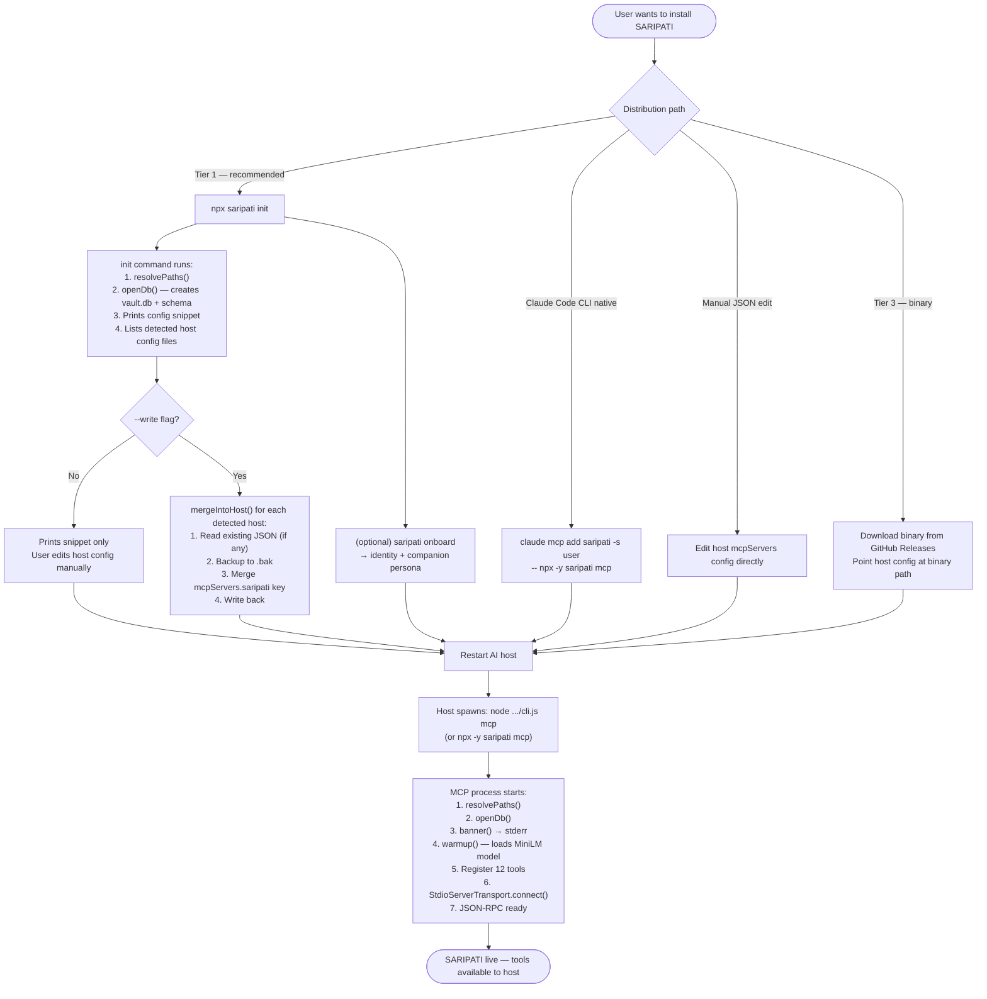
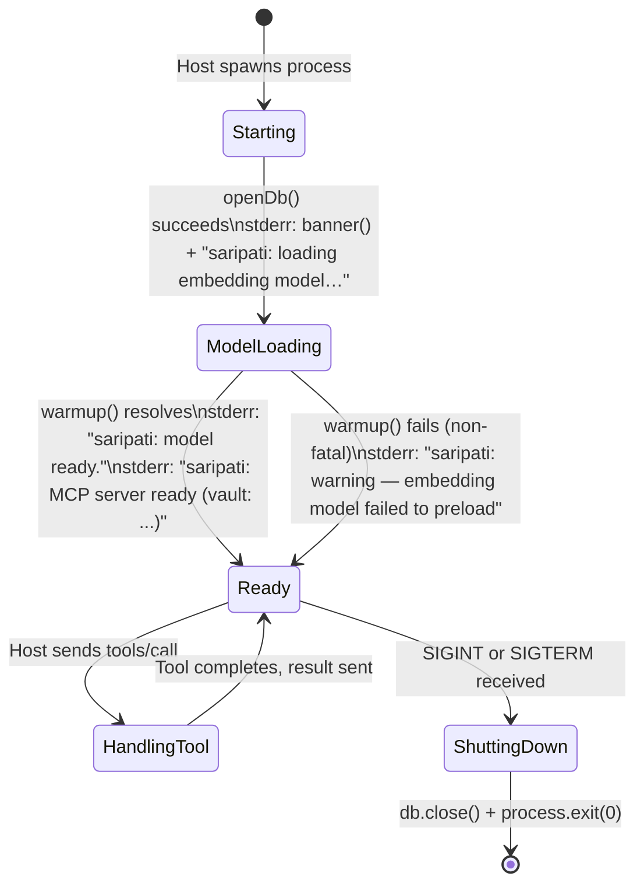
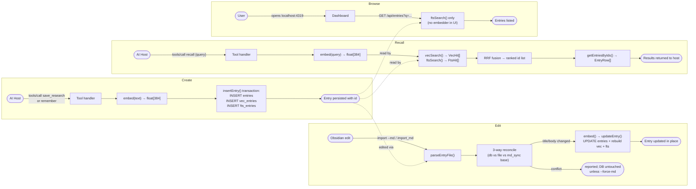
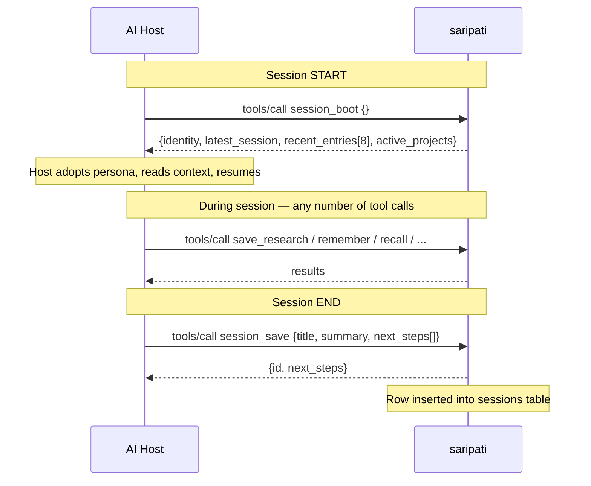
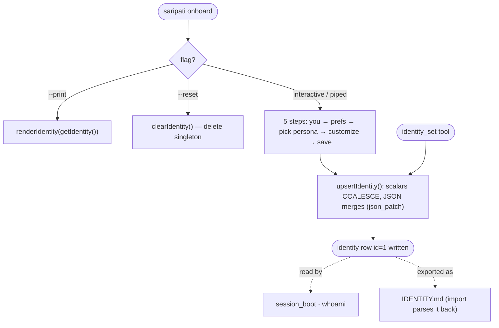
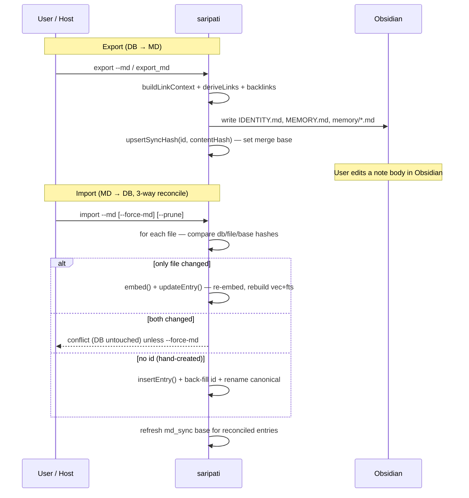
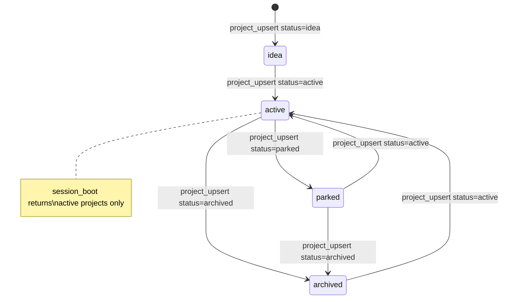
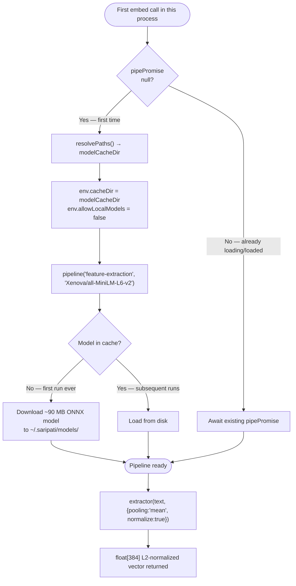
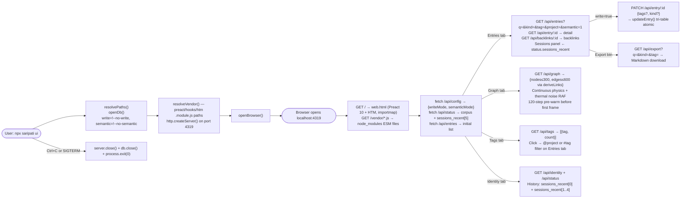

# SARIPATI — Lifecycle

## 1. Installation Lifecycle

---

## 2. Process Lifecycle (MCP server)

**Note on warmup failure:** If the model fails to preload (e.g. no internet on first run,
corrupted cache), the server still starts. The first `recall`, `remember`, or `save_research`
call that needs the embedder will attempt to load it again at that point.

---

## 3. Entry Lifecycle

**Entries are append-only through the *capture* tools** (`save_research`, `remember`) — those
never mutate an existing row. As of v0.2.0, entries **can** be edited or removed through the
Markdown sync path: `import --md` calls `updateEntry()` for a changed file (re-embedding and
rebuilding the vec + FTS rows atomically), and `import --md --prune` calls `deleteEntry()` for
entries whose files were removed. Both preserve the tri-table invariant inside one
transaction. There is still no *in-conversation* MCP tool that edits an entry's body — that
path is deliberately Obsidian-via-import.

---

## 4. Session Lifecycle

A "session" in SARIPATI is a digest record — not a live state. The pattern is:

`session_boot` reads `getIdentity(db)` (the singleton persona/profile), `latestSessions(db, 1)`
(one row), `recentEntries(db, 8)` (eight most recent entries by `created_at DESC`), and
`listProjects(db, "active")`. It does not modify state. Multiple `session_save` calls
accumulate — there is no "current session" concept; each call appends a new row.

---

## 4b. Identity Lifecycle

The `identity` row is a singleton (`CHECK (id = 1)`). `upsertIdentity` replaces scalar fields
only when provided and **merges** the `user_prefs` / `companion_config` JSON via `json_patch`,
so a host can build the persona incrementally across `identity_set` calls. Onboarding works on
a TTY (readline) or piped (buffered lines) — the same flow, scriptable for CI.

---

## 4c. Markdown Sync Lifecycle

An unedited export→import reports every entry `unchanged` — the merge base makes it a stable
no-op. `sync` runs export then import in one pass.

---

## 5. Project Lifecycle

`project_upsert` uses `INSERT ... ON CONFLICT(name) DO UPDATE`, so calling it with an
existing name performs an update. The `metadata` field is merged via SQLite's `json_patch()`
— passing `{"newKey": "val"}` adds that key without touching existing metadata fields.

---

## 6. Embedding Model Lifecycle

The singleton `pipePromise` is module-level. In a running `saripati mcp` process,
the model is loaded exactly once (via `warmup()` at startup) and reused for every
subsequent `embed()` call. The warm model adds negligible latency per call.

---

## 7. Update / Release Lifecycle

**Version semantics:**
- `npm version patch` → `0.1.0 → 0.1.1` — bug fixes, no new tools
- `npm version minor` → `0.1.0 → 0.2.0` — new tools or features, backward-compatible
- `npm version major` → `0.1.0 → 1.0.0` — breaking schema or tool API changes

The `prepublishOnly` script (`npm run build && npm test`) runs automatically on every
`npm publish`, acting as a final gate.

---

## 8. Dashboard Lifecycle

The dashboard (`saripati ui`) is a separate, independent process — it can run alongside the
MCP server or independently. It opens the same SQLite file; PATCH is always live (write mode
is on by default). SQLite WAL allows concurrent readers with no locking conflicts.

Built on **Preact 10 + HTM** (no CDN, no bundler). Vendor files resolved via CJS path +
`.module.js` suffix and served at `/vendor/preact.js`, `/vendor/hooks.js`, `/vendor/htm.js`.
An `<script type="importmap">` in the HTML resolves the bare `"preact"` specifier used by
`hooks.module.js` in the browser.

Flags are **opt-out** (both on by default):
- **`--no-write`**: disables `PATCH /api/entry/:id` (tags + kind editing).
- **`--no-semantic`**: disables hybrid search — FTS keyword only, no model load.

**Theme:** Light by default (`data-theme="light"`, `#F5F4EF` bg). Header pill switches to dark.
Persisted in `localStorage`. Graph canvas colours read `data-theme` attribute on each frame.

**Graph physics:** The RAF loop never stops. `physicsStep()` applies repulsion, spring forces,
gravity, and thermal noise (NOISE=0.18) every frame. DAMP=0.88 prevents runaway. Nodes start
on a circle (radius 42% of viewport), pre-warmed 120 ticks (no noise) before first render to
prevent the initial blast. Drag: `dragStart` position recorded; mouseup with < 8px travel = click
(navigates to entry); ≥ 8px = drag release (stays on graph, physics resumes).

**Sessions panel:** Rendered beside the entry detail (240px fixed-width column) using
`status.sessions_recent` already in the `/api/status` response — no extra API call.
