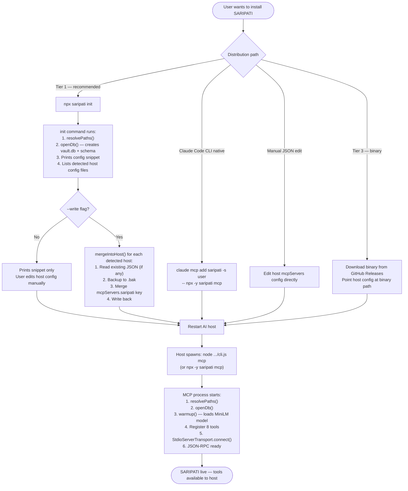
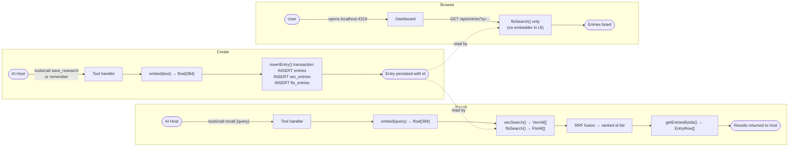
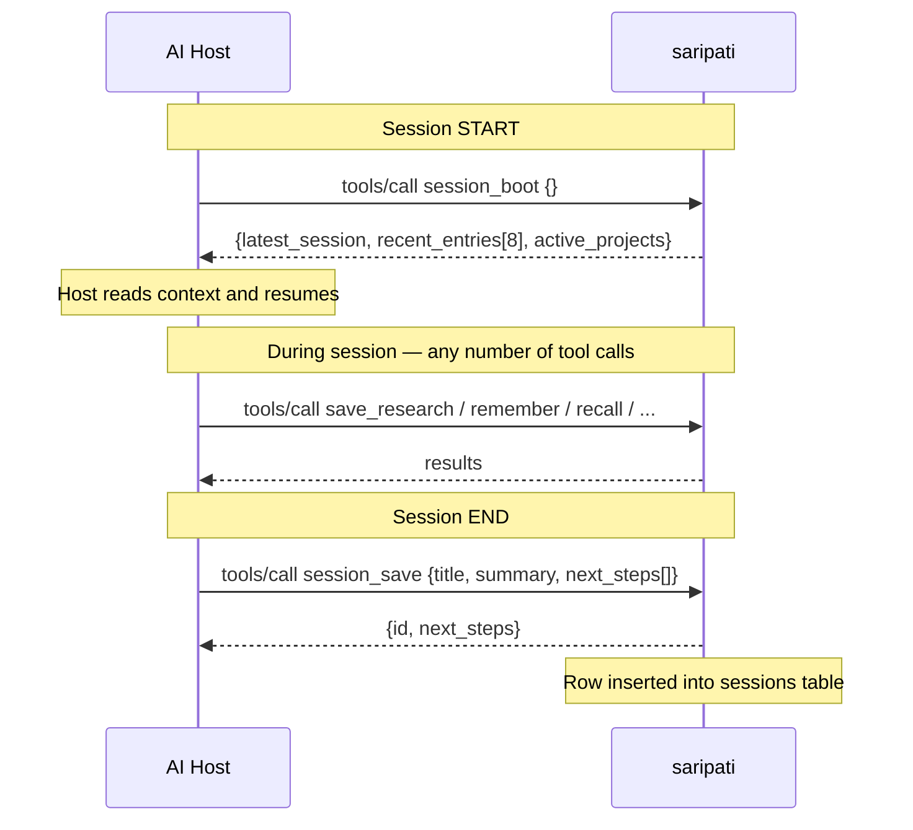
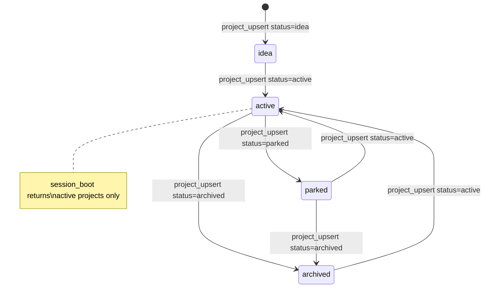
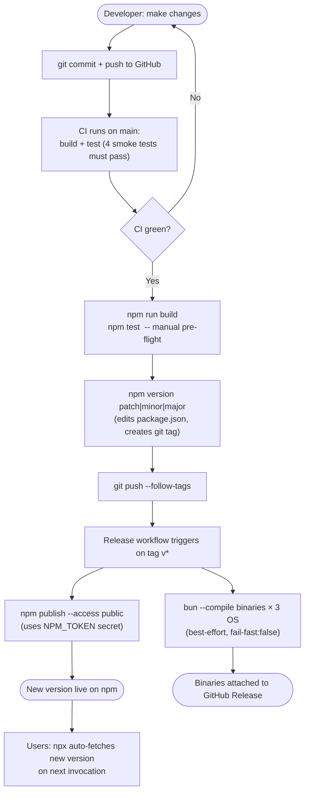
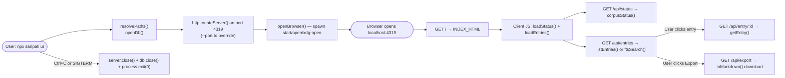

# SARIPATI — Lifecycle

## 1. Installation Lifecycle

---

## 2. Process Lifecycle (MCP server)

**Note on warmup failure:** If the model fails to preload (e.g. no internet on first run,
corrupted cache), the server still starts. The first `recall`, `remember`, or `save_research`
call that needs the embedder will attempt to load it again at that point.

---

## 3. Entry Lifecycle

**Entries are never updated or deleted through MCP tools.** The vault is append-only for
entries. Once written, an entry's id, kind, title, body, embedding, and FTS index row are
permanent for the life of the database file.

---

## 4. Session Lifecycle

A "session" in SARIPATI is a digest record — not a live state. The pattern is:

`session_boot` reads `latestSessions(db, 1)` (one row), `recentEntries(db, 8)` (eight most
recent entries by `created_at DESC`), and `listProjects(db, "active")`. It does not modify
state. Multiple `session_save` calls accumulate — there is no "current session" concept;
each call appends a new row.

---

## 5. Project Lifecycle

`project_upsert` uses `INSERT ... ON CONFLICT(name) DO UPDATE`, so calling it with an
existing name performs an update. The `metadata` field is merged via SQLite's `json_patch()`
— passing `{"newKey": "val"}` adds that key without touching existing metadata fields.

---

## 6. Embedding Model Lifecycle

The singleton `pipePromise` is module-level. In a running `saripati mcp` process,
the model is loaded exactly once (via `warmup()` at startup) and reused for every
subsequent `embed()` call. The warm model adds negligible latency per call.

---

## 7. Update / Release Lifecycle

**Version semantics:**
- `npm version patch` → `0.1.0 → 0.1.1` — bug fixes, no new tools
- `npm version minor` → `0.1.0 → 0.2.0` — new tools or features, backward-compatible
- `npm version major` → `0.1.0 → 1.0.0` — breaking schema or tool API changes

The `prepublishOnly` script (`npm run build && npm test`) runs automatically on every
`npm publish`, acting as a final gate.

---

## 8. Dashboard Lifecycle

The dashboard (`saripati ui`) is a separate, independent process — it can run alongside the
MCP server or independently. It opens the same SQLite file in **read-only mode** (all
queries are SELECTs; no writes). Because SQLite WAL mode allows concurrent readers, the
dashboard and the MCP server can operate simultaneously on the same vault file without
locking conflicts.

The dashboard **does not load the embedding model**. Search in the UI is FTS5 only — fast,
no latency, no model dependency. Semantic recall remains the AI host's job.
