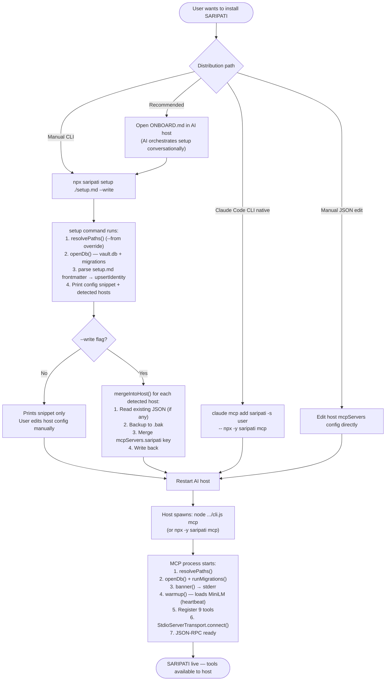
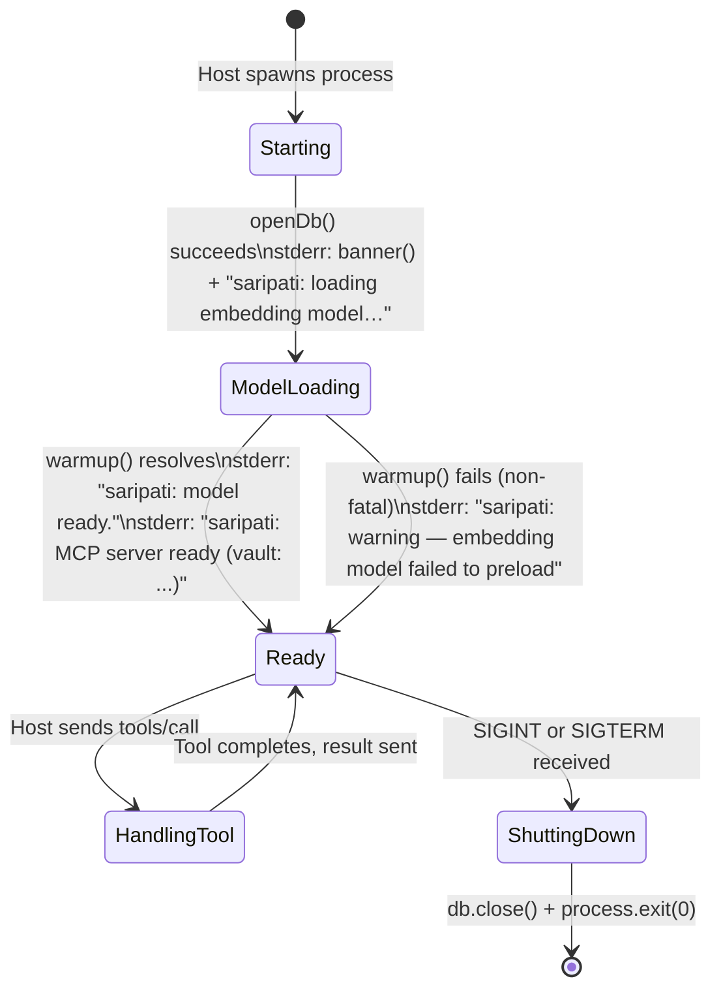
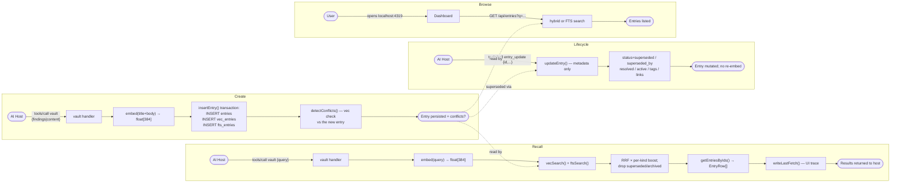
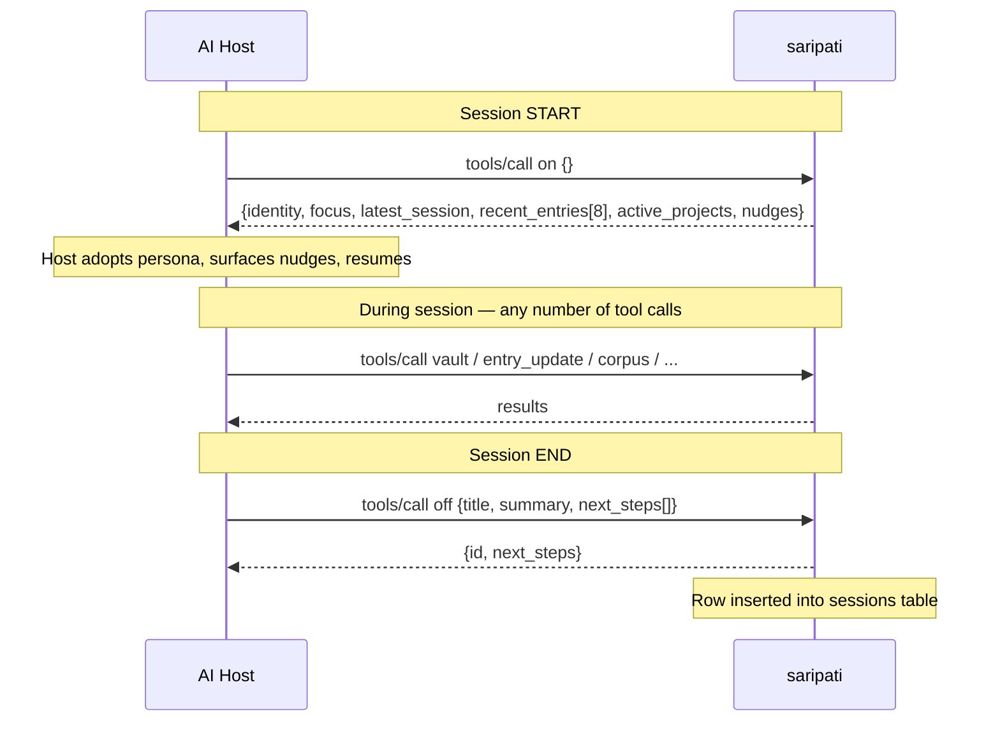
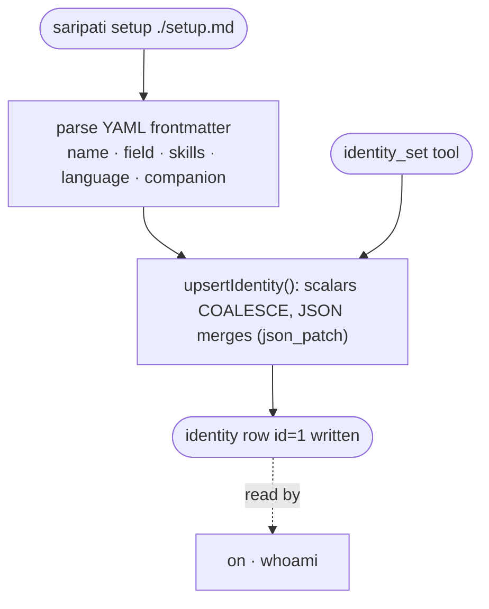
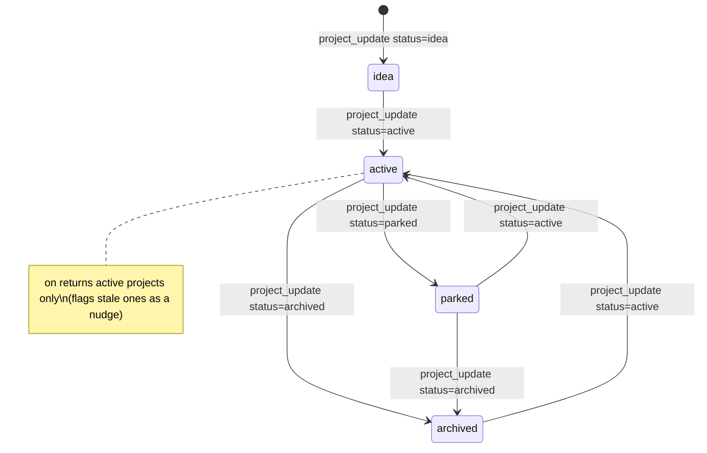
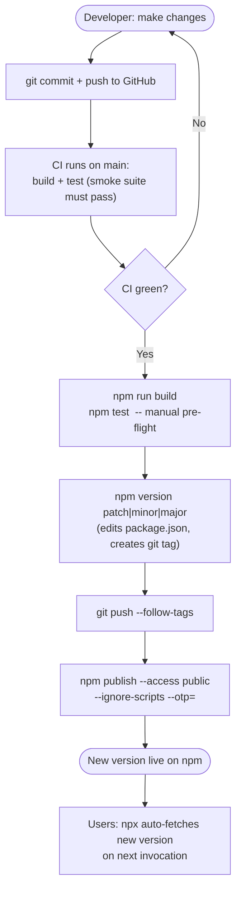
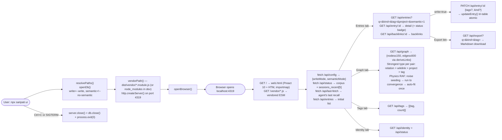

# SARIPATI — Lifecycle

## 1. Installation Lifecycle

---

## 2. Process Lifecycle (MCP server)

**Note on warmup failure:** If the model fails to preload (e.g. no internet on first run,
corrupted cache), the server still starts. The first `vault` call that needs the embedder
will attempt to load it again at that point. During load, an elapsed-time heartbeat is written
to stderr every ~12s so the process never looks hung.

---

## 3. Entry Lifecycle

**Entries are append-only through `vault` saves** — a save never mutates an existing row, but
it *does* run a conflict check and hand back near-duplicates. Lifecycle changes go through
`entry_update` (metadata-only: status, `superseded_by`, `links`, `resolved`, `active`, tags,
kind) — it never touches the body and never re-embeds. Only a title/body change (not exposed
as an in-conversation tool) would re-embed; `deleteEntry()` remains internal. All paths
preserve the tri-table invariant inside one transaction.

---

## 4. Session Lifecycle

A "session" in SARIPATI is a digest record — not a live state. The pattern is:

`on` reads `getIdentity(db)` (the singleton persona/profile — including `user_prefs.focus`,
which biases recent entries), `latestSessions(db, 1)`, `recentEntries(db, 8)`, and
`listProjects(db, "active")`. It also computes **nudges**: `unresolvedQuestions`,
`activeIntentions`, `unreadMemos` (created since the last session), and `stale_projects`. It
does not modify state. Multiple `off` calls accumulate — each appends a new session row.

---

## 4b. Identity Lifecycle

The `identity` row is a singleton (`CHECK (id = 1)`). `upsertIdentity` replaces scalar fields
only when provided and **merges** the `user_prefs` / `companion_config` JSON via `json_patch`,
so a host can build the persona incrementally across `identity_set` calls — including vault
tuning like `recall_boost`, `conflict_threshold`, `stale_days`, and `focus`.

---

## 5. Project Lifecycle

`project_update` uses `INSERT ... ON CONFLICT(name) DO UPDATE`, so calling it with an
existing name performs an update. The `metadata` field is merged via SQLite's `json_patch()`
— passing `{"newKey": "val"}` adds that key without touching existing metadata fields.

---

## 6. Embedding Model Lifecycle

The singleton `pipePromise` is module-level. In a running `saripati mcp` process,
the model is loaded exactly once (via `warmup()` at startup) and reused for every
subsequent `embed()` call. The warm model adds negligible latency per call.

---

## 7. Update / Release Lifecycle

**Version semantics:**
- `npm version patch` → bug fixes, no new tools
- `npm version minor` → new tools or features (e.g. `0.2.0 → 0.3.0`)
- `npm version major` → breaking schema or tool API changes

Publishing is done manually with a fresh OTP (the npm account uses TOTP 2FA);
`--ignore-scripts` keeps the OTP inside its ~30-second window after a manual `build` + `test`.
Single-file binaries were removed in v0.3.0 (native addons can't be bundled cleanly).

---

## 8. Dashboard Lifecycle

The dashboard (`saripati ui`) is a separate, independent process — it can run alongside the
MCP server or independently. It opens the same SQLite file and is **read-only by default**;
PATCH is enabled only with `--write`. SQLite WAL allows concurrent readers with no locking.

Built on **Preact 10 + HTM** (no CDN, no bundler). The ESM bundles are **vendored into the
package** (`dist/vendor/*.module.js`, copied at build time) and served at `/vendor/preact.js`,
`/vendor/hooks.js`, `/vendor/htm.js`; in dev (no build) the server falls back to resolving them
from `node_modules`. So `preact`/`htm` are devDependencies, absent from production installs.

Flags:
- **`--write`**: enables `PATCH /api/entry/:id` (tags + kind editing). Off by default.
- **`--no-semantic`**: disables hybrid search — FTS keyword only, no model load.

**Theme:** Light by default (`data-theme="light"`, `#F5F4EF` bg). Header pill switches to dark.
Persisted in `localStorage`. Graph canvas colours read `data-theme` attribute on each frame.

**Graph physics:** The RAF loop never stops. `physicsStep()` applies repulsion, spring forces,
gravity, and thermal noise (NOISE=0.18) every frame. DAMP=0.88 prevents runaway. Nodes start
on a circle (radius 42% of viewport), pre-warmed 120 ticks (no noise) before first render to
prevent the initial blast. Drag: `dragStart` position recorded; mouseup with < 8px travel = click
(navigates to entry); ≥ 8px = drag release (stays on graph, physics resumes).

**Sessions panel:** Rendered beside the entry detail (240px fixed-width column) using
`status.sessions_recent` already in the `/api/status` response — no extra API call.
